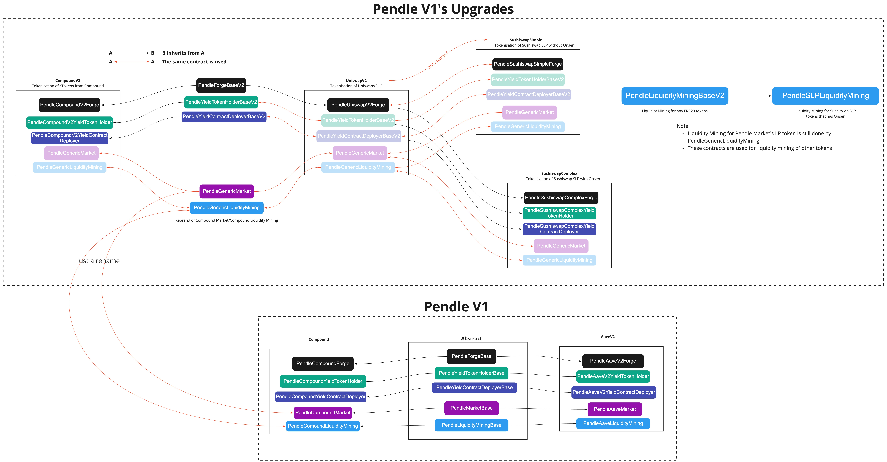

### Overview
* Pendle's V1 contracts refer to the set of contracts deployed in June 2021 that supported AaveV2 and Compound protocols
  * They include the following core contracts in the `contracts/core` folder:
    * `aave`
    * `abstract`
    * `compound`
    * All the files in the `contracts/core` folders (`PendleData.sol`, `PendleRouter`,...)
* This document describes the new "V1 Upgrades" contracts that were developed:
  * to support the tokenisation of UniswapV2 LP, Sushiswap SLP
  * to support liquidity mining of any generic ERC20 token, as well as Sushiswap SLP tokens that are on Onsen

### Contracts' structure
* It would be helpful to refer to this diagram to get the structure of the new contracts:

* A few important notes:
  * `PendleForgeBaseV2` is the base for all the forges for CompoundV2, UniswapV2, SushiswapSimple and SushiswapComplex
  * SushiswapSimple is basically the same as UniswapV2, with just a rename of the contract
  * All of the 4 protocols in the "V1 Upgrades" use the same contracts for the Market, MarketFactory and LiquidityMining (for Market LP tokens)
  * The new LiquidityMining contracts (`PendleLiquidityMiningBaseV2` and `PendleSLPLiquidityMining`) are for giving PENDLE incentives for new types of tokens
    * `PendleLiquidityMiningBaseV2`: for any ERC20 tokens
    * `PendleSLPLiquidityMining`: for a Sushiswap SLP token that is in the Onsen program. This contract will let stakers earn both PENDLE and SUSHI

* CompoundV2
  * We added a new set of contracts for Compound, called "CompoundV2", because of a few reasons:
    * Primary: the rate of underlying asset to OT/YT token is confusing (1DAI -> 46.xx cDAI -> 46.yy OT). In the new CompoundV2 forge, 1 DAI -> 46.xx cDAI -> always 1 OT+1 YT)
    * There is an additional feature of invariance check. Read more in the comments of `PendleForgeBaseV2`'s `_pushYieldToken` function

* For more details, refer to the `README.md` files in each subfolder.
